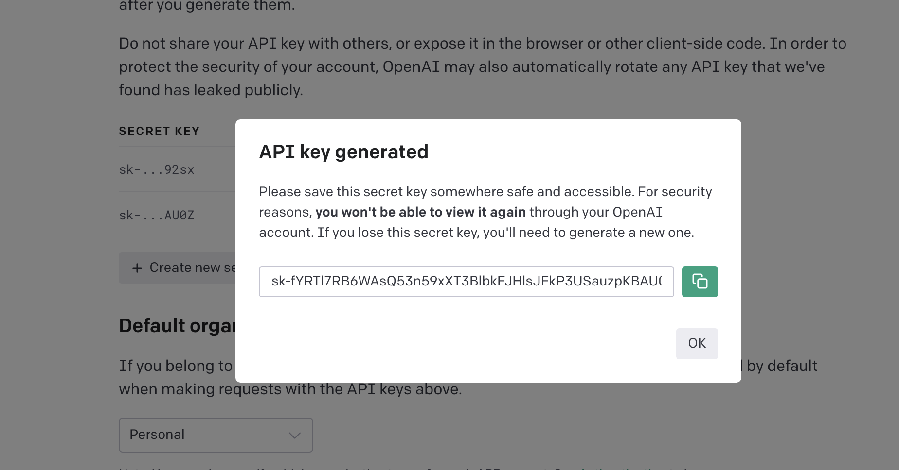
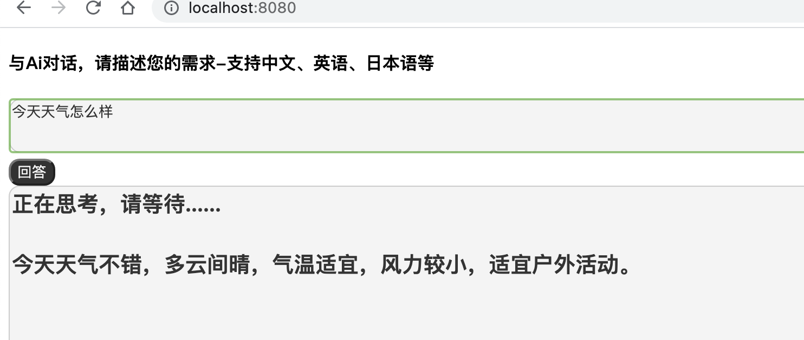
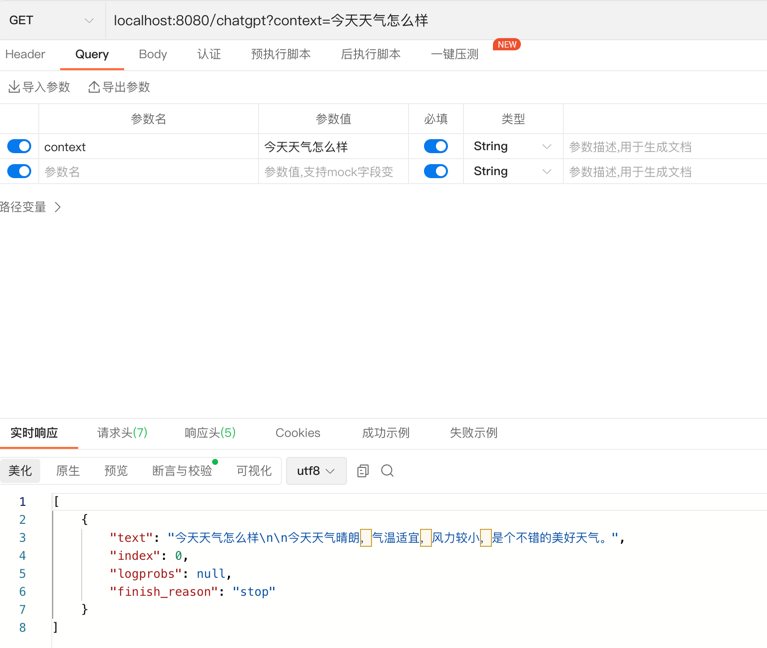

# CHATGPT的简单示例
基于ChatGPT开发一个自己的聊天机器人简单示例
## 一、准备工作
（1）已成功注册 OpenAI 的账号。

（2）创建 API KEY，这个 API KEY 是用于 HTTP 请求身份验证的，可以创建多个。注意这个创建之后需要马上复制好保存，关闭弹框之后就看不到了。

（3）官方 API 文档链接：

https://platform.openai.com/docs/api-reference/authentication

（4）注意 API 调用是收费的，但是 OpenAI 已经为我们免费提供了18美元的用量，足够大家放心使用。
## 二、补全接口示例
该接口功能较多，支持最常用的问答功能。

（1）请求方式，Post

（2）url：https://api.openai.com/v1/completions

（3）请求体 (json)。

```json
{
  "model": "text-davinci-003",
  "prompt": "Say this is a test",
  "max_tokens": 7,
  "temperature": 0,
  "top_p": 1,
  "n": 1,
  "stream": false
}
```
4）接口文档

https://platform.openai.com/docs/api-reference/completions/create

请求参数解析：

| 字段   | 说明                                        |
|----|-------------------------------------------|
| model   | 可选参数。语言模型，这里选择的是text-davinci-003          |
| prompt   | 必选参数。即用户的输入。                              |
|  max_tokens  | 可选参数，默认值为 16。最大分词数，会影响返回结果的长度。            |
|  temperature  | 可选参数，默认值为 1，取值 0-2。该值越大每次返回的结果越随机，即相似度越小。 |
|  top_p  |         可选参数，与temperature类似。                                  |
|   n|               可选参数，默认值为 1。表示对每条prompt生成多少条结果。                            |
|  stream  |        可选参数，默认值为false。表示是否回流部分结果。                                                                  |

## 三、申请API-KEY
访问地址：

https://platform.openai.com/account/api-keys

登录账号，然后创建API KEY:

这个 API KEY 是用于 HTTP 请求身份验证的，可以创建多个。注意这个创建之后需要马上复制好保存，关闭弹框之后就看不到了。
## 四、JavaScript调用API
源码在本项目的src/main/resources/static/index.html，找到以下代码块，自行替换api key
```js
      //自行替换open ai的API-KEY
      xhr.setRequestHeader("Authorization", "Bearer API-KEY");

```
看下效果：

## 五、SpringBoot使用ChatGPT API
（1）构建一个Spring Boot项目，这里使用的是2.7.8版本；
（2）利用开源项目：https://github.com/TheoKanning/openai-java
引入依赖如下：

```
<dependency>
            <groupId>com.theokanning.openai-gpt3-java</groupId>
            <artifactId>service</artifactId>
            <version>0.10.0</version>
        </dependency>
```
其service代码如下：
```java
package com.example.chatgpt.demo.service;

import com.theokanning.openai.completion.CompletionChoice;
import com.theokanning.openai.completion.CompletionRequest;
import com.theokanning.openai.service.OpenAiService;
import org.springframework.stereotype.Service;

import java.util.List;

@Service
public class ChatGPTService {
    //自行替换open ai的API-KEY
    OpenAiService service = new OpenAiService("API-KEY");
    public List<CompletionChoice> chatgpt(String context){
        CompletionRequest completionRequest = CompletionRequest.builder()
                .prompt(context)
                .model("text-davinci-003")
                .temperature(0.5)
                .maxTokens(2048)
                .topP(1D)
                .frequencyPenalty(0D)
                .presencePenalty(0D)
                .echo(true)
                .build();
        return service.createCompletion(completionRequest).getChoices();
    }

}

```
controller代码如下:
```java
package com.example.chatgpt.demo.web;

import com.example.chatgpt.demo.service.ChatGPTService;
import com.theokanning.openai.completion.CompletionChoice;
import org.springframework.web.bind.annotation.GetMapping;
import org.springframework.web.bind.annotation.RestController;

import javax.annotation.Resource;
import java.util.List;

@RestController
public class ChatGPTController {
    @Resource
    private ChatGPTService service;
    @GetMapping("/chatgpt")
    public List<CompletionChoice> chatgpt(String context){
        return service.chatgpt(context);
    }
}

```
启动项目，运行效果如下：
